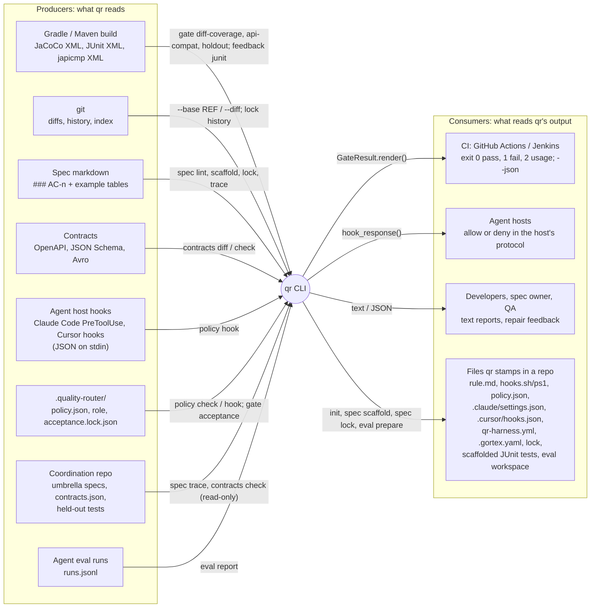
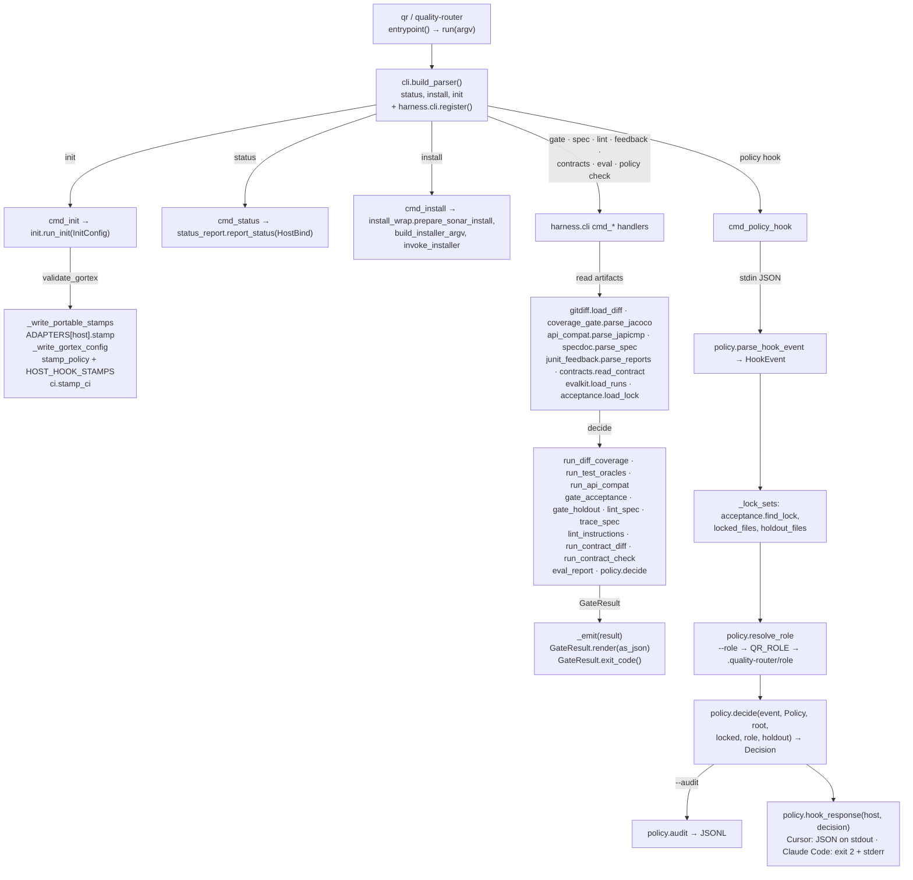
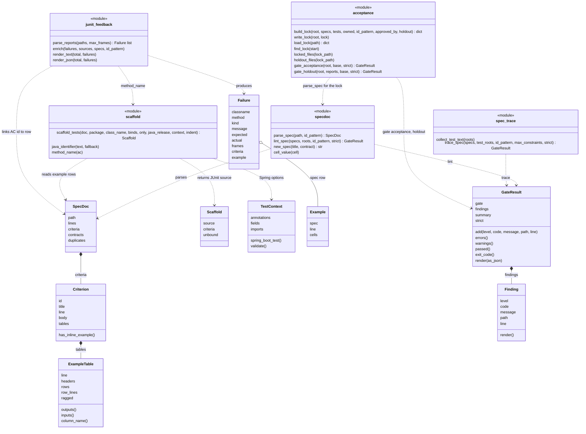
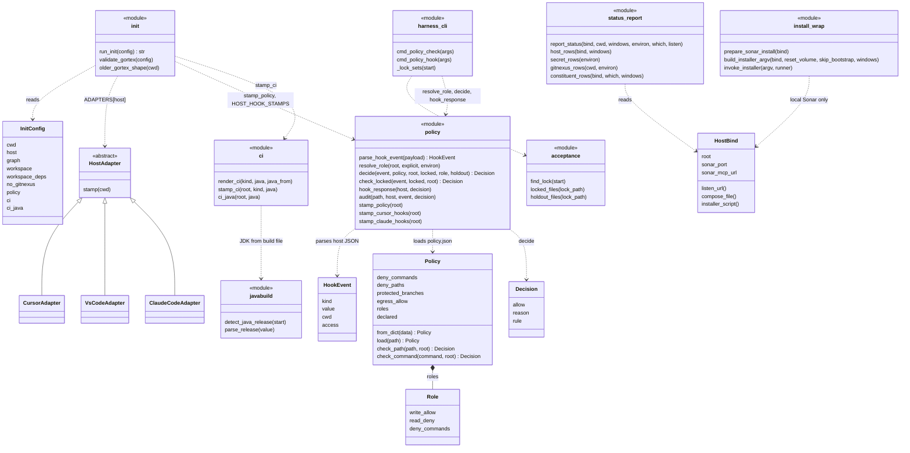

# Architecture diagrams

Generated from the code in `src/quality_router/` (Python 3.13, stdlib only).
Five views:
1. who produces `qr`'s inputs and who consumes its outputs;
2. how a command flows through the code;
3. the spec and acceptance-test pipeline;
4. the merge gates;
5. the policy, init and host layer.

Edge labels name the function or artifact that links two boxes.

## 1. Producers and consumers

`qr` reads artifacts other tools produce and writes only results, exit
codes and stamped files. It never runs a build, launches an agent, or sits
between a host and its tools.

## 2. Command flow

## 3. Spec and acceptance-test pipeline

## 4. Merge gates

```mermaid
classDiagram
    class gitdiff {
        <<module>>
        load_diff(diff_file, base, cwd, stdin_text, pathspecs)
        git_diff(base, cwd, pathspecs)
        parse_unified_diff(text)
    }
    class coverage_gate {
        <<module>>
        parse_jacoco(xml_path, cwd) JacocoReport
        run_diff_coverage(changed, reports, cwd, minimum, catch_minimum, include_tests) GateResult
        is_test_path(path)
    }
    class JacocoReport {
        path
        module_root
        lines
    }
    class LineCov {
        covered_instr
        missed_instr
        covered_branches
        missed_branches
    }
    class javasrc {
        <<module>>
        test_methods(source) TestMethod list
        catch_block_lines(source)
        blank_strings_and_comments(source)
    }
    class TestMethod {
        name
        start_line
        end_line
        body
        annotation_args
    }
    class oracles {
        <<module>>
        classify(method, helpers) OracleVerdict
        run_test_oracles(files, cwd, allow_weak, helpers) GateResult
    }
    class OracleVerdict {
        strong
        weak
        mocks
        custom
        kind()
    }
    class api_compat {
        <<module>>
        parse_japicmp(path) JapicmpReport
        run_api_compat(reports, cwd, level, ignore, allow_major_bump, strict) GateResult
    }
    class JapicmpReport {
        path
        old_version
        new_version
        classes
        changes
    }
    class ApiChange {
        class_name
        target
        kind
        type
        binary_compatible
        source_compatible
    }
    class contracts {
        <<module>>
        read_contract(spec, cwd)
        detect_kind(doc)
        diff_contracts(old, new, role, avro_mode, kind)
        run_contract_diff(old_spec, new_spec, cwd, role, avro_mode, strict) GateResult
        run_contract_check(manifest_path, checkouts, strict) GateResult
    }
    class Change {
        level
        code
        pointer
        message
    }
    class yamlsubset {
        <<module>>
        loads(text)
    }
    class instructions {
        <<module>>
        find_instruction_files(root)
        lint_instructions(root, max_lines, strict) GateResult
    }
    class evalkit {
        <<module>>
        prepare_task(repo, base, hidden, out, task_id, prompt)
        load_runs(path)
        summarize(runs) GroupStats list
        wilson(successes, n, z)
        eval_report(runs, baseline, max_token_increase, max_rate_drop) GateResult
    }
    class GroupStats {
        key
        runs
        tasks
        resolved
        rate
        ci_low
        ci_high
        tokens_per_resolved
        flip_rate
    }
    class GateResult

    coverage_gate ..> gitdiff : changed lines
    coverage_gate ..> javasrc : catch_block_lines
    coverage_gate ..> JacocoReport : parses
    JacocoReport *-- LineCov : lines
    oracles ..> javasrc : test_methods
    oracles ..> coverage_gate : is_test_path
    javasrc ..> TestMethod : produces
    oracles ..> OracleVerdict : per method
    api_compat ..> JapicmpReport : parses
    JapicmpReport *-- ApiChange : changes
    contracts ..> yamlsubset : generated OpenAPI YAML
    contracts ..> Change : classifies
    evalkit ..> GroupStats : per host@version/model
    coverage_gate ..> GateResult
    oracles ..> GateResult
    api_compat ..> GateResult
    contracts ..> GateResult
    instructions ..> GateResult
    evalkit ..> GateResult
```

## 5. Policy, init and host layer

