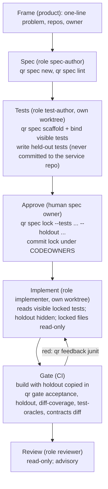

# Phase 7: the spec-driven development harness

Status: in progress. Branch `cursor/sdd-roles-holdout-5429`. Criteria (locked):
`specs/phase-7-roles-holdout.md`.

This phase makes the spec-driven flow from phases 4–6 a harness: each step
runs as a separate agent session with its own role and worktree. The policy
hook enforces what each role may read and write. The implementer is judged
partly by tests it never saw. `qr` stays a verifier: it does not launch
agents, run builds, or sit between a host and its tools (`AGENTS.md`).

## The flow

The outer graph is fixed and lives in git and CI (`research/harness-kb/dag.md`).
Each node is a bounded agent loop in any host (Cursor, Claude Code, Codex,
Hermes). The edges are files.



| Step | Role | Writes (enforced) | Cannot | Artifact (edge) | Check |
| --- | --- | --- | --- | --- | --- |
| Spec | `spec-author` | `specs/**`, `docs/**`, `*.md` | edit code or tests | spec with `### AC-n` example tables and a `Contract:` | `qr spec lint` |
| Tests | `test-author` | test source sets, `specs/**` | edit `src/main` | visible acceptance tests; held-out tests kept outside the service repo | tests are red before implementation |
| Approve | human | the lock | (human step; the hook refuses `qr spec lock` from agents) | `.quality-router/acceptance.lock.json` with hashes of visible and held-out tests | `qr gate acceptance` commit order |
| Implement | `implementer` | anything not locked or protected | read held-out tests; edit locked tests, spec, lock, policy | code | build, `qr feedback junit` |
| Gate | CI | (none) | (n/a) | JUnit and JaCoCo XML | `qr gate acceptance`, `qr gate holdout`, `qr gate diff-coverage`, `qr gate test-oracles`, `qr contracts diff` |
| Review | `reviewer` | nothing | write anything | comments | advisory only (2606.01629) |

## Roles and worktrees

`AGENTS.md` already requires one mutating director per working tree, so the
role is set per worktree, and per session:

```text
git worktree add ../svc-tests  -b spec/ITEM-142-tests
git worktree add ../svc-impl   -b feat/ITEM-142
QR_ROLE=test-author claude      # in ../svc-tests
QR_ROLE=implementer cursor .    # in ../svc-impl
```

The hook reads the role from `--role`, then `QR_ROLE`, then
`.quality-router/role` in the worktree, which must not be committed. The
agent cannot change the role or the policy: `policy.json`, the role file
and the lock are write-protected for every role.

## Held-out tests

1. The test author writes held-out tests that vary scale, boundaries and
   order (2608.19799), next to the visible ones but never commits them to
   the service repo. They live in the coordination repo
   (`holdout/<service>/...`), or in another location the implementer
   cannot check out.
2. The spec owner runs `qr spec lock --holdout <paths>` in the test-author
   worktree. The lock records each path's sha256 and criteria. The hashes
   reveal nothing about the tests.
3. The implementer works without the files. If they appear, the hook
   denies reading them.
4. CI copies them to the recorded paths before the build, runs the
   normal test task, then runs `qr gate holdout --base origin/main
   --reports '**/build/test-results/**/TEST-*.xml'`. The gate fails if a
   file is missing, changed, tracked in git, skipped or failing.

## Setting it up on a service repo

```text
qr init --policy --host claude-code --ci github-gradle   # or --host cursor, github-maven
```

Then:
- Add the holdout copy step and `qr gate holdout` to the stamped workflow.
- Put `.quality-router/` under CODEOWNERS for the spec owner.
- Make the workflow a required check: it is the same gate for every host.

A short `AGENTS.md` with build commands is optional; its evidence is
hypothesis only.

## Evidence

| Control | Finding |
| --- | --- |
| Test author separate from implementer, tests before code | 2607.05139: tests written after seeing the code lose 8–18 points of fault detection on 5 of 5 models. 2608.16742: same-agent code and tests agree on wrong behavior |
| Held-out tests | 2608.19799: agents near 97% on visible tests pass hidden validators less than half the time. 2607.24300: accept only through a harness-owned hidden audit |
| Roles and protected harness files enforced by hooks | 2608.23550: only about 4–16% of CLAUDE.md security rules have an enforcing control. 2609.00069: agents tamper with their own harness. P21 policy-as-code is consensus (6/0/2) |
| Visible locked tests stay readable | 2605.17242: acceptance-test-first loops gained when the agent could read the tests |
| Fixed outer graph, bounded loops at the nodes | `dag.md`: static workflow graphs are conditional, model-drawn DAGs only leaning, no graph runtime |

## Known limits

- **Shell detection is best effort.** A command with no path argument,
  such as `./gradlew spotlessApply`, can still rewrite files outside a
  role's `write_allow`. `qr gate acceptance` and code review are the
  backstops.
- **Hiding held-out tests depends on keeping them out of the
  implementer's worktree.** A recursive search from the root would read
  them if they were present; the hook only matches named paths.
- **Roles are only as strong as the host's hooks.** Claude Code
  `PreToolUse`, and Cursor's `beforeShellExecution`, `beforeReadFile` and
  `preToolUse`, all fail closed. Codex and Hermes need their own adapters.
